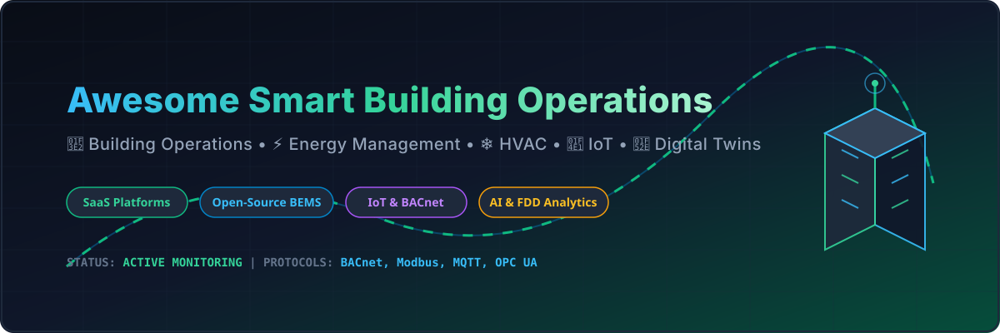

  

# 🏢 Awesome Smart Building Operations ⚡

  
  
  
  

> A curated list of enterprise SaaS platforms, open-source software, IoT frameworks, and AI analytics tools for **Smart Building Operations**, **HVAC Optimization**, **Energy Management Systems (EMS)**, **Computer-Aided Facility Management (CAFM)**, and **Digital Twins**.

---

## 📌 Table of Contents

- [💡 Market Insights & Industry Overview](#-market-insights--industry-overview)
- [☁️ SaaS / Hosted Platforms](#%EF%B8%8F-saas--hosted-platforms)
- [🔓 Open-Source GitHub Projects](#-open-source-github-projects)
- [🛠️ Protocol Stacks & Integration Frameworks](#%EF%B8%8F-protocol-stacks--integration-frameworks)
- [🤝 How to Contribute](#-how-to-contribute)
- [⚠️ Disclaimer](#%EF%B8%8F-disclaimer)
- [📈 Star History](#-star-history)

---

## 💡 Market Insights & Industry Overview

> **Market Size & Projection**: The global Smart Building Operations & Energy Management Software market was valued at **~$10.8 Billion in 2024** and is projected to reach **~$32.5 Billion by 2033**, growing at a Compound Annual Growth Rate (CAGR) of **13.5%**.

> **Market Structure & Fragmentation**: The market exhibits **concentrated leadership at the core hardware/BMS automation layer** (dominated by legacy industrial conglomerates Siemens, Honeywell, Schneider Electric, and Johnson Controls), while remaining **highly fragmented and rapidly innovating at the cloud software, AI analytics, and IoT integration layer**. Specialized SaaS startups leverage open protocols (BACnet, Modbus, MQTT) to disrupt traditional silos with autonomous HVAC optimization, predictive maintenance, and ESG compliance analytics.

---

## ☁️ SaaS / Hosted Platforms

Below is a comparative breakdown of top commercial smart building platforms, sorted descending by company size (annual revenue / estimated market valuation).

| Product | Description | Company Size (Revenue / Valuation) | Starting Tier Price | Free Tier / Free Trial Limits |
| :--- | :--- | :--- | :--- | :--- |
| **[Siemens Building X](https://www.siemens.com/buildingx)** | Open, cloud-based smart building suite for energy management, operations, sustainability, and digital twin analytics. | ~$85.0B Revenue (~$150.0B Valuation) | ~$150 / site / month (~$1,800 / year base application tier) | 6-month free trial (full feature access for 1 building site) |
| **[Honeywell Forge](https://www.honeywell.com/forge)** | Enterprise performance management platform for building operations, HVAC energy optimization, and asset health. | ~$38.5B Revenue (~$135.0B Valuation) | ~$65 / site / month (visitor & space management tier) up to enterprise scale | 14-day free trial (access to Forge Visitor & Space Manager modules, virtual walkthroughs) |
| **[Schneider EcoStruxure](https://www.se.com/ecostruxure)** | IoT-enabled smart building architecture offering Building Advisor, Power Monitoring Expert, and HVAC analytics. | ~$38.0B Revenue (~$130.0B Valuation) | ~$0.015 / sq ft / month (~$1,800 / year base Building Advisor subscription) | 30-day trial environment access (includes downloadable Building Operation demo database) |
| **[Johnson Controls OpenBlue](https://www.johnsoncontrols.com/openblue)** | AI-powered building suite for facility management, energy tracking, indoor environmental quality, and security. | ~$27.0B Revenue (~$45.0B Valuation) | ~$15,000 / year (~$0.04 / sq ft / year base Enterprise Manager license) | 30-day proof-of-concept trial (guided virtual sandbox & energy baseline assessment) |
| **[GridPoint](https://www.gridpoint.com/)** | Energy management and building automation platform for commercial facilities, with strong demand-response capabilities. | ~$100.0M Revenue (~$300.0M Valuation) | ~$250 / site / month (Energy Management as a Service subscription model) | 90-day pilot trial program (includes free preliminary building energy analysis report) |
| **[Infogrid](https://www.infogrid.io/)** | IoT sensor + AI platform for facilities management, covering occupancy, indoor air quality, energy, and compliance. | ~$50.0M Revenue (~$250.0M Valuation) | ~$1,500 / site / year (plus $15–$30 upfront per sensor hardware) | 30-day pilot deployment trial (up to 25 IoT sensors provided for testing) |
| **[BrainBox AI](https://brainboxai.com/)** | AI-driven HVAC optimization platform that autonomously adjusts setpoints to reduce energy use and carbon emissions. | ~$30.0M Revenue (~$100.0M Valuation) | ~$0.25 / sq ft / year (~$0.02 / sq ft / month subscription) | Free Energy Efficiency Audit Report + 60-day risk-free pilot evaluation period |
| **[Facilio](https://facilio.com/)** | Connected CAFM / operations platform unifying maintenance, helpdesk, vendor management, energy, and IoT workflows. | ~$20.0M Revenue (~$80.0M Valuation) | ~$10,000 / year (~$833 / month base enterprise tier) | 30-day free trial (full platform sandbox environment upon request) |
| **[Switch Automation](https://www.switchautomation.com/)** | Cloud platform for smart building data aggregation, analytics, and operational intelligence across multi-site portfolios. | ~$15.0M Revenue (~$50.0M Valuation) | ~$12,000 / year (~$0.05 / sq ft / year base portfolio tier) | 30-day proof-of-concept trial (includes guided sandbox demo & preliminary site data audit) |
| **[BuildingMinds](https://buildingminds.com/)** | Real-estate and building data platform focused on portfolio-level insights, sustainability (ESG), and operational performance. | ~$12.0M Revenue (~$50.0M Valuation) | €19.90 / building / month (~$21.50 / month) | 14-day free trial (access to dashboards, carbon tracking & ESG analytics) |
| **[Spaceti](https://www.spaceti.com/)** | Smart workplace and building platform combining occupancy sensors, space analytics, and occupant experience tools. | ~$10.0M Revenue (~$40.0M Valuation) | ~$99 / month (~$1,188 / year base plan) | 14-day free trial (access to occupancy analytics, workplace maps & sensor dashboards) |
| **[Enertiv](https://www.enertiv.com/)** | Building operations and energy intelligence platform focused on real-time monitoring, fault detection, and cost reduction. | ~$8.0M Revenue (~$30.0M Valuation) | ~$0.01–$0.02 / sq ft / month for commercial ($1.00 / unit / month for residential) | 30-day proof-of-concept trial (includes live system demo & portfolio energy benchmark) |
| **[Clockworks Analytics](https://clockworksanalytics.com/)** | Analytics platform specializing in Fault Detection & Diagnostics (FDD), energy optimization, and continuous commissioning. | ~$7.0M Revenue (~$25.0M Valuation) | ~$0.02–$0.05 / sq ft / year (~$2,500 / year base entry tier) | 30-day proof-of-concept trial (includes FDD diagnostic audit & sample building setup) |
| **[BuildingIQ](https://buildingiq.com/)** | Predictive HVAC energy optimization and building analytics software (legacy operations). | ~$2.0M Revenue (Liquidated Entity) | ~$1.00–$2.00 / sq m / year (~$10,000 / year initial deployment baseline) | 30-day pilot trial (limited to 1 HVAC air handling unit / 50,000 sq ft assessment) |

---

## 🔓 Open-Source GitHub Projects

Sorted descending by GitHub star count. Each badge links directly to the repository's stargazers page.

- **[Home Assistant Core](https://github.com/home-assistant/core)**   
  Popular open-source home and building automation platform featuring 2000+ integrations, local-first control, automation engine, and privacy-centric design.

- **[ThingsBoard](https://github.com/thingsboard/thingsboard)**   
  Enterprise-grade open-source IoT platform for device management, telemetry data collection, real-time processing, rule-based automation, and smart building dashboards.

- **[Node-RED](https://github.com/node-red/node-red)**   
  Low-code programming tool for event-driven applications, flow-based visual logic, and wiring together building automation hardware, sensors, and APIs.

- **[MyEMS](https://github.com/MyEMS/myems)**   
  Industry-leading open-source Energy Management System aligned with ISO 50001. Supports collection, analysis, and reporting of electricity, water, gas, heating, cooling, and carbon emissions for commercial buildings and campuses.

- **[DGIoT](https://github.com/dgiot/dgiot)**   
  Lightweight open-source industrial IoT stack supporting hundreds of building and industrial automation protocols (BACnet, Modbus, OPC UA, MQTT) with SCADA components.

- **[EnergyPlus](https://github.com/NREL/EnergyPlus)**   
  NREL's flagship whole-building energy simulation program for modeling energy, water, HVAC, lighting, ventilation, and thermal performance in commercial structures.

- **[BACnet Stack](https://github.com/bacnet-stack/bacnet-stack)**   
  Open-source C protocol stack implementing the BACnet protocol for building automation networks, microcontrollers, and IoT gateway interfaces.

- **[VOLTTRON](https://github.com/eclipse-volttron/volttron)**   
  Eclipse Foundation's agent-based platform for smart building control, energy analytics, fault detection, and distributed energy resource (DER) grid integration.

- **[OpenStudio](https://github.com/NREL/OpenStudio)**   
  Cross-platform software suite supporting building energy modeling, advanced HVAC analytics, and EnergyPlus workflow orchestrations.

- **[OpenBMS](https://github.com/openbms/openbms)**   
  Community-driven, vendor-neutral Building Management System framework focused on open standards (BACnet, MQTT, Modbus) and modern web UI components.

- **[Rosetta Home](https://github.com/rosetta-home/rosetta_home)**   
  Offline-first building performance monitoring and automation platform with energy tracking, HVAC telemetry, and environment sensor integrations.

- **[Colibri](https://github.com/dschachinger/colibri)**   
  Smart building energy management research project leveraging semantic building models (BIM/Ontology) for flexible energy optimization strategies.

---

## 🛠️ Protocol Stacks & Integration Frameworks

- **BACnet / Modbus / KNX Protocol Libraries**: Open-source drivers and gateway layers for bridging legacy fieldbus networks to modern cloud APIs.
- **Time-Series Databases & Telemetry**: InfluxDB, TimescaleDB, Grafana, and Prometheus stacks for high-frequency sensor dashboards and alert management.
- **Low-Code Visual Flow Tools**: Node-RED flows and MQTT brokers (EMQX, Mosquitto) for local resilience and edge decision engines.

---

## 🤝 How to Contribute

1. Fork the repository.
2. Add your entry to `README.md` under the appropriate section.
3. Ensure entries link to official websites or GitHub repositories with factual descriptions.
4. Submit a Pull Request (PR) with a brief summary of your contribution.

Check out [Awesome-Awesome-Awesome](https://github.com/ishandutta2007/Awesome-Awesome-Awesome) for more awesome lists!

---

## ⚠️ Disclaimer

- This list is **community-curated** for informational and research purposes only.
- Smart building operations interact with critical facility infrastructure (HVAC, fire safety, power). Always consult qualified energy engineers and cybersecurity specialists before production deployment.

---

## 📈 Star History

---

  Made with ❤️ for facility managers, energy engineers, building operators, and smart-city technologists worldwide.

